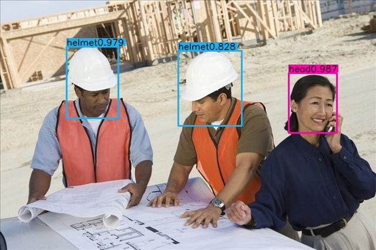

# A PyTorch implementation of CenterNet and MobileNetV3 


## Introduction

CenterNet with MobileNetV3 backboned helmet detection based on PyTorch with inference code only.

This repo is forked from [CenterNet](https://github.com/xingyizhou/CenterNet) and [MobileNetV3](https://github.com/xiaolai-sqlai/mobilenetv3).





## Installation

```
cd $ROOT/lib/models/networks/DCNv2
python setup.py build develop
```


## Usage

```
python demo.py
```

